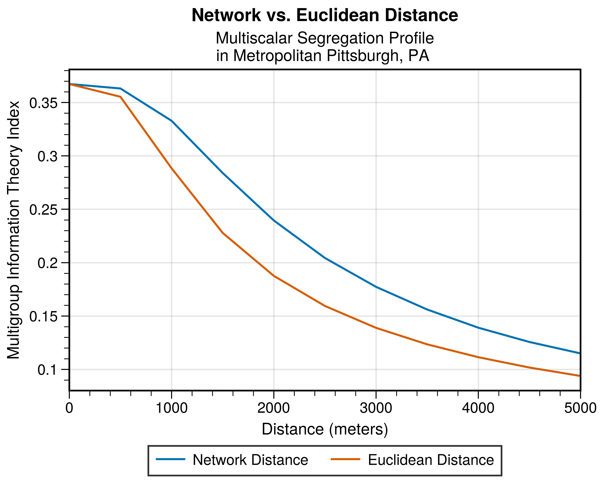

!include tables/one_pct_pandas.md

{#fig:nup width=85%}

{#fig:scatter width=45%}
{#fig:diff_hists width=45%}

Network vs. Euclidean-based Segregation Indices

{#fig:correlations width=90%}

{#fig:multiscalar}

