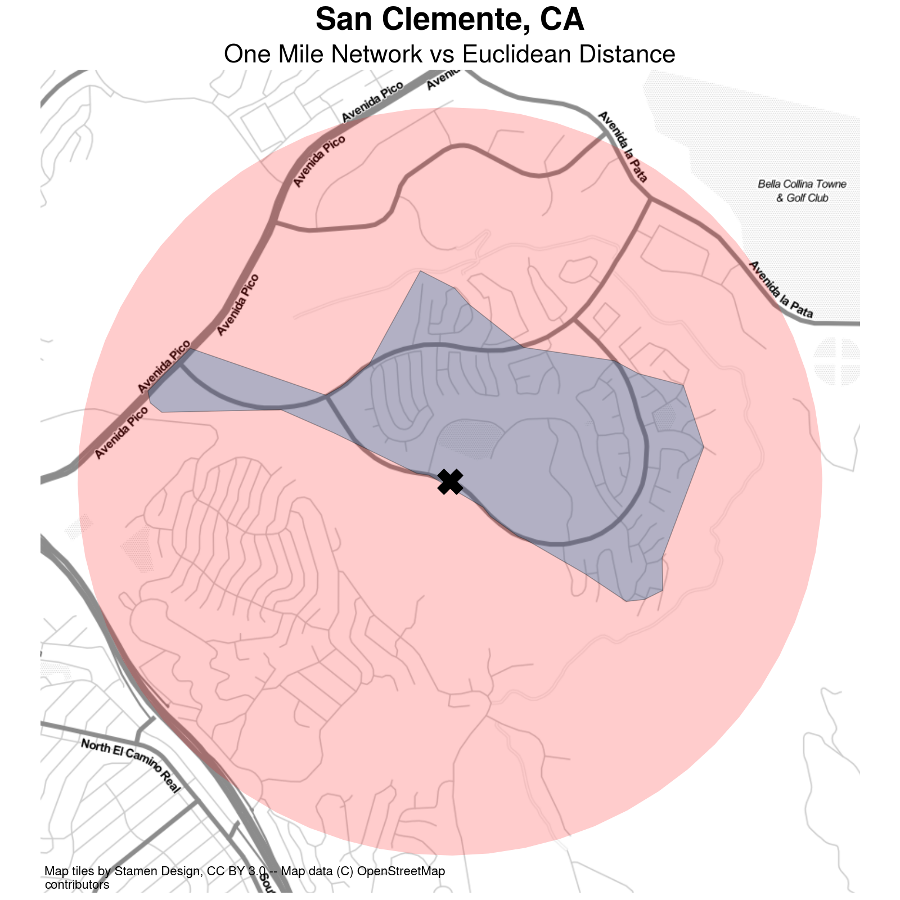

Classically, space is represented in fields like sociology by membership inside discrete
containers--such as a neighborhood unit. Deeply influential scholars like
[@burgess1928ResidentialSegregation;@Park1925] conceived of neighborhoods or cities as discrete,
bounded areas that conditioned the social behavior of residents living inside them. As ideas from
the Chicago School of sociology began permeating the nascent field of regional science in the 1950s,
economists and location theorists combined them with concepts from @von_thunen_isolierte_1826,
@christaller1937LandlicheSiedlungsweise, and @christaller1937LandlicheSiedlungsweise, using distance
from the city center to explain the arrangement of jobs and housing as well as the transport of
goods from outlying agricultural areas to markets at the urban core
[@ullman1941TheoryLocation;@sinclair1967ThunenUrban], culminating in the famous monocentric city
model [@alonso1964LocationLand;@mills1967AggregativeModel;@muth1969CitiesHousing]. 

The monocentric model signals a change in the representation of *space* from a discrete concept to a
continuous one, and given the focus on urban economic processes such as weight loss and weight gain,
transport connectivity is implicit in these early concepts, but additional considerations such as
highway throughput or shipping lanes are not considered in early economic models because neither the
data nor computational power existed to dig deeper. In recent decades, that pattern has changed
dramatically. Given the rapid adoption of technologies like GIS, combined with exploding data
resources, statistical literacy, and computational power, a wide variety of social scientists are
exploring more realistic methods for incorporating spatial relationships into their analyses. In
fields like quantitative geography and spatial econometrics, this trend is revealed by the
increasing focus on spatial weights matrices that represent space in formal models, and in sociology
and human geography, the trend in segregation research is increasingly sophisticated concepts of the
local neighborhood experienced by each resident.

## Incorporating Distance into Segregation Indices

### Making Space Explicit

@reardon2004MeasuresSpatial
@reardon2009RaceSpace
@wong1997SpatialDependency
@bailey2012HowSpatial
@rey2011ImpactSpatial
@osullivan2007SurfaceBasedApproach
@wong2004ComparingTraditional
@dawkins2004MeasuringSpatial

### Interrogating Spatial Scale

 A variety of authors have begun to examine the role of spatial scale. In an important advance in
 segregation methods, @reardon2008GeographicScale develop a method for understanding the
 implications of multiscalar segregation by varying the distance parameter used to compute the local
 environment in a spatial segregation index, and @lee2008CensusTract apply the framework to a large
 set of metropolitan regions in the U.S., demonstrating a wide variety of macro versus micro-scaled
 patterns. Another prominent body of work builds on this work, exploring the notion of "egohoods,"
 where each household has its own concept of the neighborhood that extends outward and partially
 overlaps with others nearby
 [@hipp2013EgohoodsWaves;@petrovic2019FreedomTyranny;@petrovic2018MultiscaleMeasures]. Even more
 recently, additional measurement techniques have been developed that help summarize multiscalar
 patterns using a single index (as opposed to an array or a ratio)
 [@bezenac2022MeasuringVisualizing;@olteanu2019SegregationMultiscalar;@osth2015MeasuringScale; @clark2015MultiscalarAnalysis].
 Together this research has provided clear evidence not only of the importance of considering
 spatial relationships in segregation measurement, but also the ways that misspecification of space
 (such as application of an inappropriate scale) can lead to a skewed concept of the phenomenon
 under study.

## Transportation and Social Interaction

Elsewhere, scholars have examined the role of physical barriers and built features of the urban
environment in facilitating social contact. For example @grannis2005TCommunitiesPedestrian shows
social interactions are more frequent inside "T-communities" defined by street networks
[@grannis2005TCommunitiesPedestrian], and @roberto2018SpatialProximity uses street networks to
measure segregation in a small-scale case study, and shows that segregation in Pittsburgh is higher
when measured according to network distance. These contributions emphasize a long-recognized but
understudied element of metropolitan segregation patterns, namely that transport networks, physical
barriers, and other factors such as elevation or congestion change the expected potential for social
interaction in space. For example work in sociology has shown the importance of street network
connectivity in fostering connected social networks inside small urban geographic zones
[@grannis1998ImportanceTrivial]. The natural logic underlying these findings is that street networks
can help insulate urban environments and provide greater exposure to residents living inside "the
neighborhood" than those who live outside, but this distinction can be masked easily when measuring
metropolitan space using euclidean distances.

{#fig:distance_sd width=49%}
{#fig:distance_chi width=49%}

Network Distance vs Euclidean Distance in Urban Environments

A depiction of the difference between network travel distance and "as the crow flies" distance is
shown in @fig:network_distance. The figure shows an origin marked with an X in the center, and two
different polygons representing a one-mile travel distance using different methods. The small
polygon depicts the total extent accessible from the origin point when traveling along the
pedestrian network, whereas the larger polygon depicts the 1-mile buffer representing unconstrained
travel. It is immediately apparent in the figure that network-constrained travel covers a much
smaller footprint than euclidean distance in the depicted location. Furthermore, the pattern appears
to be influenced strongly by the street network and urban design features that characterize the
largely suburban region of San Clemente.

Instead of a regular grid that facilitates travel in all directions (like the densely urbanized
section of Chicago in @fig:distance_chi), the street network in @fig:distance_sd includes several
insular patterns, cul-de-sacs, and 3-way intersections that help channel traffic in certain
directions rather than others. Furthermore, the fact that some subdivisions have only a single
entrance makes clear how much further a person would need to travel to reach the homes in certain
regions (versus how much easier they appear to be reached via the circular buffer). By contrast, the
regular gridded pattern in Chicago in @fig:distance_chi allows travel to flow in all directions.
Because the origin starts on a street oriented East-West, the polygon covers essentially the entire
circular buffer in that direction. The North-South direction is limited, however for two reasons,
first, the traveler needs to reach a cross street before changing direction, and second the Kennedy
expressway provides a man-made physical barrier that impedes travel in the southwestern direction,
creating a hard edge in the inner polygon except along a single passageway. A similar phenomenon
impedes traffic in the northward direction, as the network does not extend into Saint Luke Cemetery.

Using evidence from a case study in Pittsburgh, @roberto2018SpatialProximity [p. 28] argues that,
"even small positive differences in the city-level results are meaningful and suggest that physical
barriers facilitate greater separation between ethnoracial groups and higher levels of segregation."
We agree with the spirit of this assessment, however, we would extend and clarify that physical
barriers themselves do not necessarily create greater separation between groups--although action by
other parts of the urban system such as inequitable land use planning or racial steering by lenders
or agents can (and does) interact with these barriers to create segregated real estate markets and
phenomena such as one group living on the "other side of the tracks"
[@roberto2018SpatialProximity]. 

Further, as @fig:network_distance shows, it is not simply the presence of physical barriers, but
also the geometric design and topological structure of the travel network that facilitates
separation between people in urban space. The curvilinear, meandering streets and abundance of
cul-de-sacs in San Clemente stand in sharp contrast to the dense, regular grid in Chicago, even
though the network in Chicago also includes additional barriers like highways. In what follows, we
examine the magnitude of differences between network and simple euclidean measures in detail for
every metropolitan region in the United States. Specifically, we expand upon prior work in three
different directions. First, we expand the geographic scope by considering every metropolitan region
in the United States, rather than a case study of a single city. Second, we adopt a computational
inference framework that allows us to assess whether the observed differences between the
segregation measures are large enough that they could not happen by chance. Finally, we explore the
relationship between differences in observed segregation and characteristics of the local travel
network.
