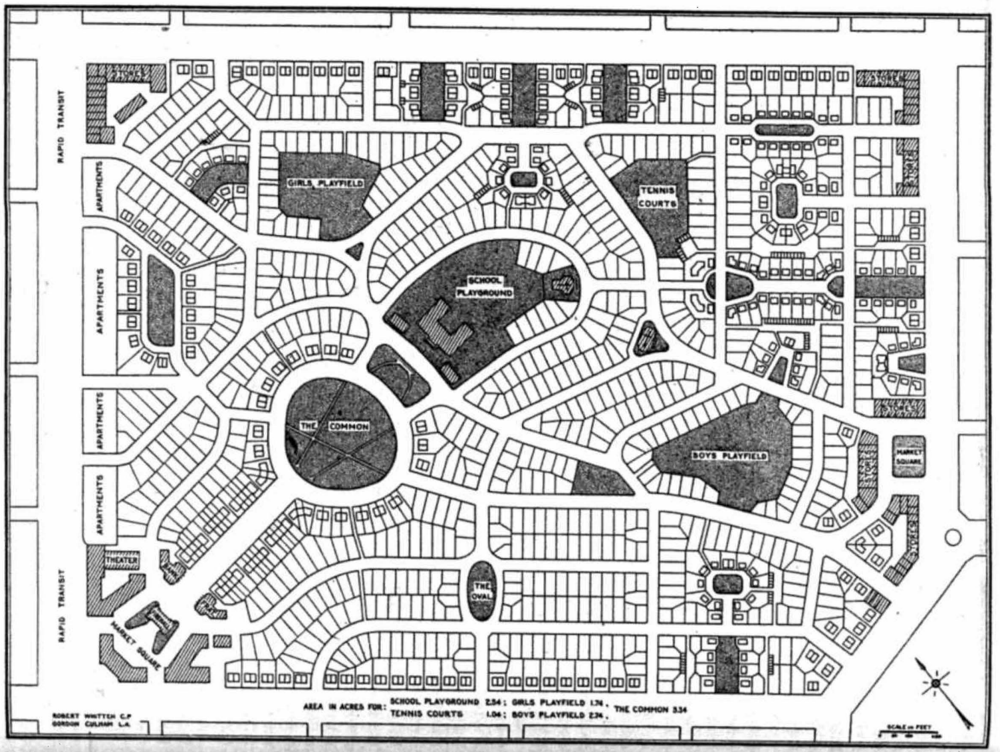

<!-- Hook -->

An exceedingly common abstraction in applied spatial analysis is the use of euclidean distance as a
proxy measure for geographic proximity (which is, itself, often a proxy for the frequency of social
interaction). It is the geographical scientist's equivalent to the physicist's spherical
cow[^spherical_cow], or the economist's perfect market: a useful abstraction that helps partially
explain a much more complex underlying process, however imperfectly. A major difference in spatial
analysis, however, is that scientists from many disciplines often fail to realize how simplified the
assumption of euclidean distance is when traversing the built or natural environment. While, in
general, simple proximity is a reasonable heuristic for understanding Tobler's Law
[@tobler1970ComputerMovie], the behavioral realities of movement and social interaction in complex
urban environments often require a more thoughtful model.

More directly, cities, regions, and neighborhoods are not featureless planes in which agents have
perfect freedom of mobility. Rather, they are multifaceted environments populated by highways,
canyons, rivers, mountains, railroad tracks, alleyways, and power plants. To facilitate movement in
this environment, an interleaved transportation system provides passageways through discrete
locations, and conditions how easy it is to move throughout the region and interact with individuals
in other parts of the region. Although pure euclidean distance can proxy this system, the urban
design decisions that govern how and where networks are located, as well as the natural features
like elevation or water features play an important albeit underexamined role in mediating social
interactions.

One particular topic where a full understanding of space would provide significant benefits is
segregation analysis, a longstanding topic of focus across the disciplines of urban social science.
Classically, segregation indices are calculated based on areal groupings (e.g. counties or census
tracts), with more recent research exploring ways that spatial relationships can enter the equation.
Spatial segregation measures embody the notion that proximity to one's neighbors is a better
specification of residential segregation than simply who resides together inside the same
arbitrarily-drawn polygon. Thus, they expand the notion of "who is nearby" to include those who are
geographically close to each polygon rather than a binary inside/outside distinction. Yet spatial
segregation measures often resort to crude measurements of proximity, such as the euclidean distance
between observations, given the complexity and data requirements of calculating more
theoretically-appropriate measures, such as distance along the pedestrian travel network.

<!-- Question -->

In this paper, we examine the relationship between pedestrian network characteristics and the
measurement of metropolitan segregation. In doing so, we examine three research questions in turn:
first, how much does the operationalization of space matter for segregation measurement? More
specifically, how large is the difference between euclidean-based and network-based measures of
spatial segregation? Second, if reasonable differences exist between euclidean and network measures,
are they large enough that they cannot be attributed to chance? Third, what characteristics of the
travel network explain the observed difference in measurement? If there is a large and/or systematic
difference between traditional spatial measurements and those leveraging more realistic measurements
of distance, then there may be much to learn about the contribution of network structure and design
when seeking to maximize urban integration.

<!-- Antecedents -->
## Designing and Measuring Urban Space

Since the inception of city planning, the relationship between social interactions and the built
environment has been a topic of intense focus for both social scientists and urban designers
[@talen2017SocialScience]. The normative concepts of urban utopias prescribed by architects like
Ebeneezer Howard, Frank Lloyd Wright, and Le Corbusier included distinct visions for how densely
populated and separated/integrated land uses could facilitate the ideal level of interaction between
a resident and (a) her neighbors, and (b) her natural surroundings
[@howard2001GardenCities;@lecorbusier1986NewArchitecture;@campbell1996ReadingsPlanning]. Combining
these visions with ideas from @wirth1938UrbanismWay and the famous 'neighborhood unit plan'
articulated by @perry1929neighborhood, large scale developers like James Rouse developed concepts
for new towns like Columbia, Maryland that were based largely on the design of insular street
networks [@olsen2003BetterPlaces].

{#fig:nup width=70%}

At their best, these designs were intended to foster community for the residents that live within
them, and ensure that amenities like school, shopping, employment, and leisure are all within a
walkable distance from the neighborhood's core. From a more cynical perspective, the cul-de-sac
patterns and interspersed greenways of the 'neighborhood unit plan' helped codify the American ideal
of white flight and the picturesque upper-middle class neighborhood, using both urban design and
land-use policy as informal mechanisms of residential sorting. Thus, although the arrangement of
people in space has been a focus of urban thought for more than a century, it remains an open
question how well features of the real urban fabric are represented in quantitative models of social
interaction, such as segregation indices--and whether urban design characteristics shape our
perception of these patterns.

Classically, space is represented in fields like sociology by membership inside discrete
containers--such as a neighborhood unit. Deeply influential scholars like
[@burgess1928ResidentialSegregation;@Park1925] conceived of neighborhoods or cities as discrete,
bounded areas that conditioned the social behavior of residents living inside them. As ideas from
the Chicago School of sociology began permeating the nascent field of regional science in the 1950s,
economists and location theorists combined them with concepts from @von_thunen_isolierte_1826,
@christaller1937LandlicheSiedlungsweise, and @christaller1937LandlicheSiedlungsweise, using distance
from the city center to explain the arrangement of jobs and housing as well as the transport of
goods from outlying agricultural areas to markets at the urban core
[@ullman1941TheoryLocation;@sinclair1967ThunenUrban], culminating in the famous monocentric city
model [@alonso1964LocationLand;@mills1967AggregativeModel;@muth1969CitiesHousing]. 

<!-- Value-Added -->

The monocentric model signals a change in the representation of *space* from a discrete concept to a
continuous one, and given the focus on urban economic processes such as weight loss and weight gain,
transport connectivity is implicit in these early concepts, but additional considerations such as
highway throughput or shipping lanes are not considered in early economic models because neither the
data nor computational power existed to dig deeper. In recent decades, that pattern has changed
dramatically. Given the rapid adoption of technologies like GIS, combined with exploding data
resources, statistical literacy, and computational power, a wide variety of social scientists are
exploring more realistic methods for incorporating spatial relationships into their analyses. In
fields like quantitative geography and spatial econometrics, this trend is revealed by the
increasing focus on spatial weights matrices that represent space in formal models, and in sociology
and human geography, the trend in segregation research is increasingly sophisticated concepts of the
local neighborhood experienced by each resident.

One prominent body of work explores the notion of "egohoods," where each household has its own
concept of the neighborhood that extends outward and partially overlaps with others nearby
[@hipp2013EgohoodsWaves;@petrovic2019FreedomTyranny;@petrovic2018MultiscaleMeasures]. Elsewhere,
scholars have examined the role of physical barriers and built features of the urban environment in
facilitating social contact. For example @grannis2005TCommunitiesPedestrian shows social
interactions are more frequent inside "T-communities" defined by street networks,
@roberto2018SpatialProximity uses street networks to measure segregation in a small-scale case
study, and a variety of authors have begun to examine the role of spatial scale
[@lee2008CensusTract;@reardon2008GeographicScale;@bezenac2022MeasuringVisualizing;@olteanu2019SegregationMultiscalar;@osth2015MeasuringScale; @clark2015MultiscalarAnalysis]

<!-- Road-map -->

Now we have both the tools and the logic to test these assumptions and understand the role of
abstractions such as euclidean distance-based measures in our assessment of critical social
processes such as residential segregation. Fast graph algorithms allow us to construct more
realistic concepts of spatial weights matrices, and computational statistics allow us to construct
and test realistic null hypotheses about the allocation of urban population groups. Here, we examine
the role of street network topology in the appropriate measurement of urban segregation. Our goals
are twofold.

First, we aim to understand the implications of simple Euclidean distance- based abstractions when
conducting formal spatial analyses; that is, do we find substantive differences in results when more
realistic concepts of spatial relationships (e.g. network connectivity) are considered? Second, we
aim to explore the elements of urban design (particularly the street network configuration) in
widening the gap between analytical abstraction and empirical reality. More simply, we aim to
understand whether certain elements of the street network are associated with a greater difference
in measured segregation. With this knowledge, urban designers and planners can begin with more
inclusive communities from the beginning.

[^spherical_cow]: <https://en.wikipedia.org/wiki/Spherical_cow>