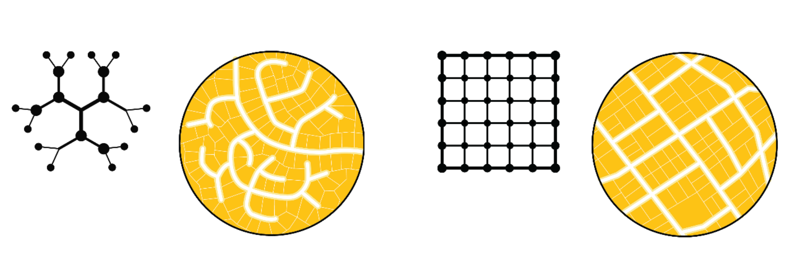

## Metropolitan Travel Infrastructure as a Network Graph

The travel infrastructure in a metropolitan region serves as its skeleton for both urban development
and social interactions. For decades, scholars have worked to quantify the aspects of urban form
that help explain behaviors such as travel mode choice
[@crane2000InfluenceUrban;@clifton2008QuantitativeAnalysis;@ewing2009MeasuringUnmeasurable@ewing2010TravelBuilt].
A recent evolution of this work is the conception of a travel network as a formal graph structure
[@boeing2018PlanarityStreet;@boeing2018MorphologyCircuity;@fleischmann2021MethodologicalFoundation;@fleischmann2018MeasuringUrban;@araldi2019StreetMetropolitan;@dibble2019OriginSpaces],
and a set of software tools that facilitate its analysis as such
[@boeing2016OSMnxNew;@fleischmann2019MomepyUrban]. Understanding the travel network as a topological
graph provides a different picture of its accessibility structure and the way it facilitates
interaction among residents [@levinson2017ElementsAccess]. Here our goal is to use these graph
topology metrics to explain the variation we observe in $\Delta_{tilde{H}}$.

## Measuring Graph Structure

We use the Python packages OSMNx [@boeing2016OSMnxNew] and Momepy [@fleischmann2019MomepyUrban] to
create measures of the pedestrian travel network collected from OpenStreetMap. Together, these
measures provide an overall summary of the morphophological properties of the travel graph
structure, and are described in @tbl:variables. In addition to simple measures like the total length
and density of streets, the count and density of intersections, and the proportion of intersections
at different levels of throughput, we focus in particular on three measures of the graph structure:
cyclomatic complexity, meshedness, and circuity. In theory, all three measures should be related to
the observed difference in segregation when measured in network distance versus euclidean distance.
All else equal, the difference should be smaller when: cycloymatic complexity and meshedness are
higher, and when circuity is lower. Each of these conditions should, in theory, lead to greater flow
along the network and a better approximation of unconstrained euclidean travel.

<!-- 
To modify this table, edit the contents of data/network_variables.csv
then, generate the latex by running notebooks/model_difference.ipynb
-->

!include tables/variables.md

Cyclomatic complexity can be viewed as a measure of the network's redundancy, and its ability to
provide alternative passages when a given route is blocked. According to @bourdic2012AssessingCities
[p.599], "the cyclomatic number represents the number of primary loops in the network. The greater
the number of loops, the greater the number of possible routes in the city... it is more efficient
to propose a multiplicity of smaller roads so users can choose and spread over these paths, which
are ultimately better suited to the variety of their destinations. The cyclomatic number refers to
this multiplicity of loops that increase the number of possible paths. In a public transport network
with a high cyclomatic number, a failure in one station will not freeze an entire zone". As such, we
would expect that an increase in cyclomatic complexity would reduce $\Delta_{\tilde{H}}$, as more
routes are available to provide a short route between two destinations.

The meshedness coefficient is "based on the notion of circuits (or faces), network regions enclosed
by loops of linked edges and nodes (analogous to an urban block surrounded by streets) that provide
alternate movement routes" [@feliciotti2018ResilienceUrban]. Meshedness is the "ratio of the number
of faces in the network to the maximum possible number of loops in an equivalent network with the
same number nodes" [@fleischmann2022EvolutionUrban]. @buhl2006TopologicalPatterns use the meshedness
coefficient to assess the connectedness of a graph, and whether its configuration is closer to a
tree-like network or to a maximally connected grid. As @feliciotti2018ResilienceUrban describes, "in
strictly tree-like networks, origins and destinations are only linked via a single path, which means
that users have only one choice of movement and any point failure in that route would cause major
disruption on performance. In turn, grid-like networks provide many ways to get to a same place,
greater choice for the user and reduced impact of point failure."

<!-- Martin says she's cool with us using this fig -->
{#fig:meshedness width=80%}

In the example of @fig:network_distance, the network in San Clemente [@fig:distance_sd] is more
tree-like than the gridded network in Chicago [@fig:distance_chi], indicating that meshedness is
higher for Chicago than San Clemente. This distinction is shown similarly in the stylized depiction
of meshedness created by @feliciotti2018ResilienceUrban in @fig:meshedness, with the lefthand
diagram having a more tree-like structure and thus a lower meshedness coefficient than the diagram
on the right. Given the clear difference between @fig:distance_sd and @fig:distance_chi, we would
expect that greater meshedness would result in lower $\Delta_{\tilde{H}}$ because a denser network
results in a further potential travel distance.

Circuity is a measure of the "windingness" of a city's streets. It is a ratio of an edge's network
distance to the euclidean distance between its starting and ending nodes. In stylized terms, it
represents the difference between walking between any two intersections and flying between them. For
example, a mountain switchback trail would have a higher circuity measure than a flight of stairs
that connected the same two origins and destinations. The former would be easier to traverse because
of its less intense elevation, but the path would sacrifice greater distance traveled as a result.
Here, our measure of circuity is the average taken over all edges in the network. All else equal, we
would expect that a lower circuity measure would result in a lower $\Delta_{\tilde{H}}$ because
network distance is closer to euclidean distance.
