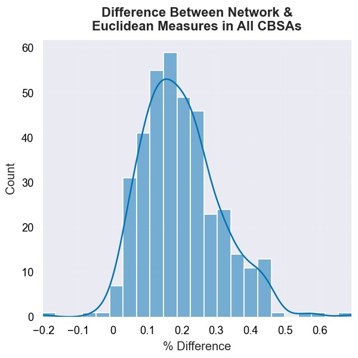

## Network Distance is an Important Consideration

Although the correlation between planar and network based segregation
measures is $\rho=0.987$, our results provide clear evidence that the
choice of appropriate distance metric plays an important role in the
computation of a spatial segregation index. In all but four cases, we
show that segregation is higher when measured according to network
distance than by pure euclidean distance[^CRS] (none of the four cases
are significant different from a random pooling of the same
data). Among the 380 CBAs in our dataset, 25.3% have a difference
between euclidean and network-based segregation measures that is
signficant at the $\alpha=0.05$ level, and 14.2% of the CBSAs are
significant at the $\alpha=0.01$ level. Descriptive statistics of the
differences between segregation measures in each metro are shown in
@tbl:diff_descriptives, and a list of the 54 CBSAs significant at the
one percent level are listed in @tbl:one_pct_diffs. Among these 54
CBAS, eight metros are located in California--twice the number of the
next-most prevalent state (Texas)

{#fig:diff_hists width=40%}

!include tables/difference_descriptives.md

The shape of distribution of differences is approximately normal. While the absolute difference
between the two segregation measures in each CBSA can appear small, the relative difference is often
reasonably large, with the network-based segregation measure approximately 20% higher than the
euclidean-based measure on average. The largest relative difference gets as high as 69% (Carson
City, NV).

!include tables/one_pct_diffs.md

[^CRS]: For each CBSA in our sample, our euclidean distances are based on UTM coordinate systems,
with each region's data projected into its appropriate UTM zone.
