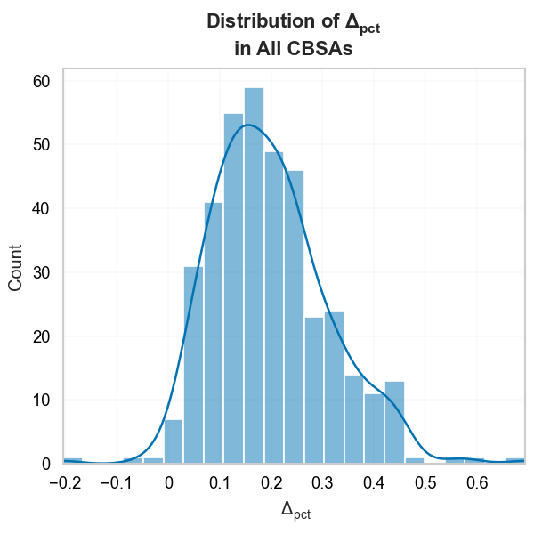

## Network Distance is an Important Consideration

{#fig:scatter width=45%}
{#fig:diff_hists width=45%}

Network vs. Euclidean-based Segregation Indices

@fig:scatter portrays the relationship between segregation measured using the two
different distance metrics for the sample CBSAs. Although the correlation between planar
and network based segregation measures is $\rho=0.987$, our results provide clear
evidence that the choice of appropriate distance metric plays an important role in the
computation of a spatial segregation index. In all but four cases, segregation is higher
when measured according to network distance than by pure Euclidean distance[^CRS] (none
of the four cases are significantly different from a random pooling of the same data).
Among the 380 CBAs in our dataset, 25.3% have a difference between Euclidean and
network-based segregation measures that is significant at the $\alpha=0.05$ level, and
14.2% of the CBSAs are significant at the $\alpha=0.01$ level. Descriptive statistics of
the differences between segregation measures in each metro are shown in
@tbl:diff_descriptives, and a list of the 54 CBSAs significant at the one percent level
are listed in @tbl:one_pct_diffs. Among these 54 CBAS, eight metros are located in
California--twice the number of the next-most prevalent state (Texas).

!include tables/difference_descriptives_pandas.md

The distributions of both $\Delta_{\tilde{H}}$ and $\Delta_{pct}$ are normally-shaped
with respective means of 0.029 and 0.198 respectively. While the absolute difference
between the two segregation measures in each CBSA can appear small, the relative
difference is often reasonably large, with the network-based segregation measure
approximately 20% higher than the Euclidean-based measure on average. The largest
relative difference gets as high as 69% (Carson City, NV), and the smallest differences
are zero (Hattiesburg, MS, Longview, TX, Rocky Mount, NC, and California-Lexington Park,
MD). There is no clear spatial or regional patterning apparent in either the segregation
differences or the CBSAs with significant differences. While we would not expect a process of spatial
spillover to reveal itself in this analysis, it is possible that urban design paradigms
are regional, and could explain large-scale patterning in the observed segregation
differences. We interpret the lack of spatial patterning as evidence that metropolitan
regions have a reasonable degree of control over how the street grid is constructed, and
thus local design decisions that influence the travel network topology may provide
insight into the differences. In the following sections we probe these relationships in
more detail.

<!-- Do a quick Moran using KNN?  Maybe using join counts for significant/not?-->

[^CRS]: For each CBSA in our sample, our Euclidean distances are based on UTM coordinate systems,
with each region's data projected into its appropriate UTM zone.
