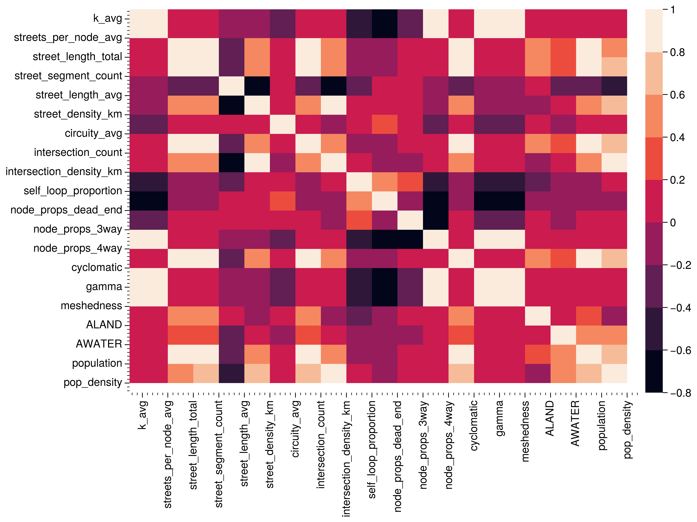

## Graph Topology and Segregation Differences

To understand how urban design decisions such as the topology of the travel network may impact the
ability for residents to interact (as measured by the segregation index), we begin with an
exploration of correlation among different variables that characterize the graph topological
structure, as well as the correlation between $\Delta_{\tilde{H}}$ and network structure.

{#fig:heatmap width=70%}

@fig:correlations portrays the pairwise correlations between the
percentage difference in the two segregation measures and different
properties of the networks in each of the CBSAs.  The strongest
correlation is between the percentage difference and the size of the
difference in segregation. This indicates that the percentage
differences are not an artifact of a small denominator problem,
whereby low levels of planar segrgation would result in even small
differences between network and planar based segregation to appear to
be large.

{#fig:correlations width=70%}

Focusing on the network properties, as the proportion of 4-way
intersections increases the difference between segregation measured
using network and planar distances grows.  Segregation
differences also growth with the average node incidence, street
length, edge length, and circuity of the network.
In general, as the size of the network increases, the difference in
the segegation measures decreases.  The relative differences in
segregation measures are negatively associated with the level of
segregation in the city.

<!-- I can drop some of the measures such as p-value, but for the ones
to keep, i'm unclear what all the properties are. Maybe these should
be defined above in the methods section and then I can refer to them
here in the narrative -->

Caution about isolating on bivariate relationships and motivate the models that are to come next.

Our two-value test is doing a good job (i.e., it is picking up a difference)

The ps_inter is an interaction term between the planar_measure and whether the two-value test was significant. This tells us that the slope is larger for those cities where the difference in the two-value test is significant.

The pct difference generally declines with the overall level of segregation and network size (as measured by street_length) althoug the latter association appears to be driven by the places with the significant two-value tests

## Modeling the Difference Between Metrics

To understand the importance of graph structure on the difference between segregation measurements
we also construct a simple regression model using ordinary least squares in which the difference in
segregation is a function of metropolitan network characteristics and population controls,

$$
\Delta_{\tilde{H}} = \alpha + \beta X + \epsilon
$${#eq:diff_model}\
where $\alpha$ is a constant, $X$ is a subset of the variables described in @tbl:variables, and
$\epsilon$ is a vector of random errors. 

<!-- the only change between input is the distance metric, so associations could have a causal interpretation? is that worth it? -->

<!-- this table is ugly. It might be worth doing this in R instead -->
!include tables/regression.md

After removing collinear variables (see @fig:heatmap) such 